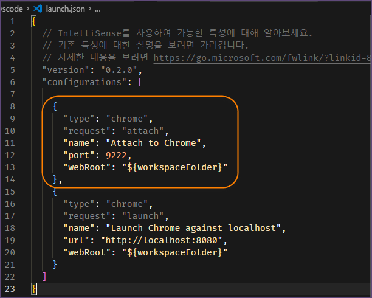
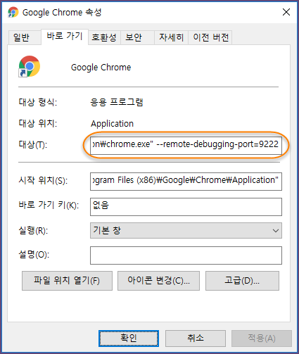
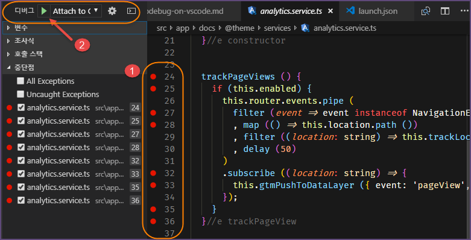
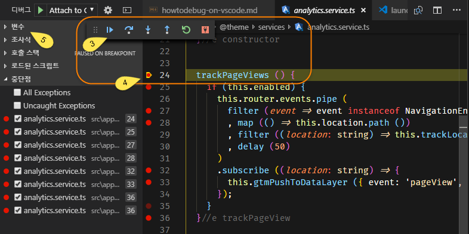

# VS Code에서 Debugger 사용하기

- VS Code에서 `Debugger for Chrome` 설치
- Runtime에 Debugger를 병행 실행
- 원하는 Inspection 수행

<center>
<div class="mermaid">
graph TB
  dbg-.->|inspection|var
  subgraph Debugging
    dbg((Debugger<br>for Chrome<br><strong>F5</strong>))
  end
  subgraph Runtime
    bp1(Breakpoints N)
    bp1-->var
    bp1-->F10[<strong>F10</strong>]
    bp1-->F11[<strong>F11</strong>]
    bp1-->SF11[<strong>Shift+F11</strong>]
    F10-->var
    F11-->var
    SF11-->var
    var(Variables<br>Expression<br>Call Stack)
    next(Next <strong>F10/F11/SF11</strong>)
    var-->next
    next-->bp1
  end
</div>
<h6>Fig1. Inspection Diagram</h6>
</center>
<hr>


### 1. VS Code에서 Debugger for Chrome 설치

- VS Code 에디터에서 `Debugger for Chrome` Extension을 설치한다
  - `Extension(Ctrl+Shift+X)`에서 
<hr>


### 2. VS Code Debugging 구성 추가

- VS Code `Debug`메뉴에서 실행 화살표(녹색) 옆 목록박스에서 `Chrome` 혹은 `구성 추가`를 선택
- `launch.json`파일에서 Chrome 브라우저와 연결하는 `configurations`항목 하나를 추가한다.

```ts

{
  "type": "chrome",
  "request": "attach",
  "name": "Attach to Chrome",
  "port": 9222,
  "webRoot": "${workspaceFolder}"
}
...

```

<center>
  
  <h6>Fig2. launch.json 항목 추가</h6>
</center>
<hr>


### 3. Chrome Browser 실행파일 설정

- `Chrome Browser` 실행파일 속성정보에서 
  - `chrome.exe --remote-debugging-port=9222`을 설정한다

<center>
  
  <h6>Fig3. Google 실행파일 속성</h6>
</center>
<hr>


### 4. 적용 방법

- project를 `ng serve` 실행한다
- vs code 에디터에서 `Ctrl+Shift+D`를 실행하여 디버거 탐색창을 연다
- 디버그할 ts 코드의 원하는 line number 왼쪽에서 `중단점(적색점)`을 표시한다
- `디버깅 시작` 혹은 `계속(F5)` 버튼으로 디버깅을 시작한다
- `Fig5. 1`의 5개 버튼을 사용하여 적절하게 디버그 상황을 진행한다
  - `계속(F5)`: 진행시킨다
  - `단위실행(F10)`: 함수단위로 진행시킨다
  - `단계진입(F11)`: 함수 안으로 진행시킨다
  - `단계탈출(Shift+F11)`: 함수 안에서 빠져 나온다
  - `다시연결(Ctr+Shift+F5)`: project를 refresh 실행한다(첫번째 만나는 breakpoint에 위치한다)
  - `연결끊기`: 디버거를 종료한다
<hr>


### 5. 사례

- `Fig4. 1`은 원하는 중단점의 모습이다
- `Fig4. 2`를 사용하여 디버그를 실행한다

<center>
  
  <h6>Fig4. 디버그 명령
</center>

- `Fig5. 3`으로 상황에 맞는 실행명령을 수행한다
- `Fig5. 4`는 실행명령에 따른 중단점이 이동하는 모습이다
- `Fig5. 5`의 `변수`, `조사식`, `호출스택` 등으로 실시간 상황을 조사한다

<center>
  
  <h6>Fig5. 디버그 실황
</center>
<hr>


# link test
- [top](#VS-Code에서-Debugger-사용하기)
- [top][VS-Code에서-Debugger-사용하기]
